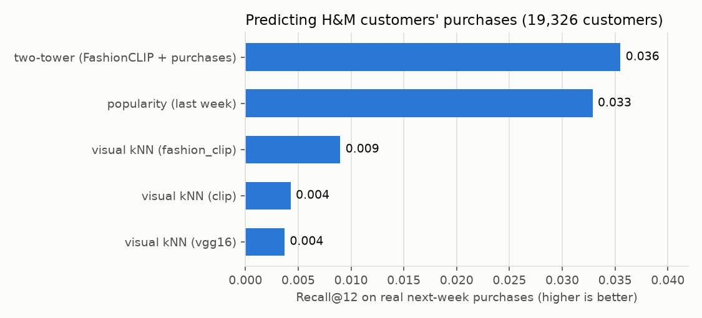
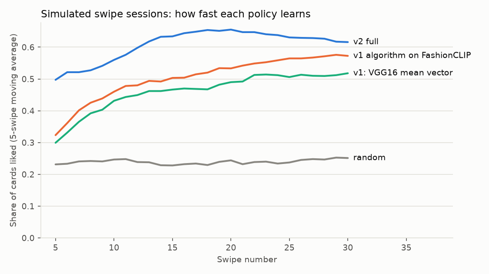

# FindYourFit

A Tinder-style fashion app backed by a real recommendation system. Swipe right on clothes
you like and left on the rest. Every swipe updates a Bayesian model of your taste, and the
next card is picked by a two-stage recommender built on **FashionCLIP** image/text
embeddings and a **two-tower model trained on 4.6M real H&M purchases**.

- **Learns from every swipe.** Per-session Bayesian logistic regression (Laplace posterior) with tempered Thompson sampling. Likes and passes both count, and before your first like it explores by uncertainty (UCB).
- **Several tastes, not one average.** Likes are clustered into separate "interests" (black trousers, floral blouses…), each retrieved and scored on its own.
- **Steer with words.** Type "in red" or "jackets" and the deck filters to match, still ranked by your taste. FashionCLIP puts text and images in one space.
- **Explains itself.** Every card has a "Why?" panel: the liked items it resembles, how much each signal contributed to its score, and the predicted match.
- **Measured, not claimed.** Real held-out purchases plus simulated swipe sessions, with baselines, ablations, confidence intervals and a tuning/test split ([reports/eval.md](reports/eval.md)).

```
OFFLINE  (ml/, PyTorch + CUDA, ~10 min on an RTX 4060 laptop GPU)
  H&M: 105k articles, 105k images, 31M transactions
    -> prepare_hm.py        current-assortment catalog (18,068 garments), 26 weeks of purchases, time split
    -> embed_catalog.py     FashionCLIP image + text vectors   (+ OpenAI CLIP, VGG16 baselines)
    -> train_two_tower.py   two-tower next-purchase model, full softmax over the catalog
    -> build_artifacts.py   FAISS indices, k-means style prototypes, feature calibration -> backend/models/
    -> evaluate.py / tune_session.py

ONLINE  (backend/recsys/, ~20 ms per swipe on CPU)
  session: likes, passes, text steers
    -> candidates   two-tower user vector · per-interest visual kNN · Thompson-sampled query
                    · text-steered search · style prototypes · trending
    -> ranking      tempered Thompson draw from the session posterior (+ UCB bonus before the first like)
    -> re-ranking   MMR visual diversity · one colour variant per product · near-duplicates dropped
    -> explanation  sources · nearest liked items · score breakdown · p(like) ± uncertainty
  -> React swipe deck · swipe events logged to data/events/*.jsonl
```

## Results

All numbers come from `ml/evaluate.py` (seed 42) and are reproducible from the data. Full
tables: [reports/eval.md](reports/eval.md).

**1. Real next-week purchases.** 19,326 H&M customers; history = everything before the last
week; predict the new items they buy in the last week.



| Method | Recall@12 | MAP@12 | HitRate@12 | Catalog coverage |
|---|---|---|---|---|
| Visual kNN, VGG16 (v1's features) | 0.0037 | 0.0012 | 0.86% | 68.5% |
| Visual kNN, OpenAI CLIP | 0.0043 | 0.0013 | 0.95% | 66.5% |
| Visual kNN, FashionCLIP | 0.0090 | 0.0027 | 1.92% | 69.7% |
| Popularity (last week) | 0.0329 | 0.0117 | 7.47% | 0.09% |
| **Two-tower (FashionCLIP + purchases)** | **0.0355** | **0.0128** | **7.63%** | **25.5%** |

The two-tower beats popularity (+8% recall, +9% MAP), a notoriously strong baseline on this
dataset, while covering 280× more of the catalog. It reaches 9.6× the recall of VGG16 features.

**2. Simulated swipe sessions.** 300 real customers act as simulated users. Each likes a card
when its (product type, colour family) appears in their real purchases, with 10% label noise.
The rule uses metadata the image models never see, so it isn't circular. Each user plays
30 swipes per policy. Hyperparameters were tuned on a *different* set of users (seed 7,
`ml/tune_session.py`).



| Policy | Like rate ± s.e. | Swipes 11–30 | Diversity¹ | Coverage² |
|---|---|---|---|---|
| Random | 0.240 ± 0.006 | 0.240 | 0.409 | 39.0% |
| Popularity | 0.360 ± 0.009 | 0.327 | 0.338 | 0.2% |
| **v1: VGG16 + mean-of-likes vector (the original app)** | 0.452 ± 0.014 | 0.495 | 0.239 | 32.8% |
| v1 algorithm on FashionCLIP | 0.493 ± 0.016 | 0.543 | 0.201 | 33.9% |
| **v2 (this system)** | **0.599 ± 0.016** | **0.634** | **0.312** | 17.0% |

**v2 vs the v1 algorithm on the same users: +10.6 points [95% CI +6.9, +14.3]; +33% relative
to the original app**, with 31–55% more diverse sessions.

Ablations (each removes one part of v2; paired difference vs v1-on-FashionCLIP in brackets):

| Variant | Like rate | Diversity | Coverage | Takeaway |
|---|---|---|---|---|
| v2 | 0.599 [+0.106] | 0.312 | 17.0% | |
| without visual-similarity features | 0.420 [−0.073] | 0.338 | 8.5% | the biggest single contributor |
| standard Thompson (temperature 1) | 0.567 [+0.075] | 0.336 | 20.6% | too much exploration for 30 swipes |
| greedy (temperature 0) | 0.643 [+0.150] | 0.279 | 9.5% | highest like rate, half the coverage |
| without UCB onboarding | 0.587 [+0.094] | 0.329 | 18.3% | UCB gives faster cold starts |
| without two-tower | 0.608 [+0.115] | 0.292 | 17.4% | neutral here (within noise) |
| single interest | 0.613 [+0.120] | 0.301 | 17.0% | neutral here (within noise) |

¹ 1 − mean pairwise visual cosine of the 30 cards shown. ² Share of the catalog shown across all sessions.

Reading the ablations honestly:
- **Greedy vs tempered Thompson is a deliberate trade-off.** Simulated users have fixed tastes, so exploration can't pay off in this simulator by construction. Greedy wins on like rate but nearly halves catalog coverage. Real tastes drift, so v2 keeps some exploration.
- **The two-tower and multi-interest components don't move the simulated like rate.** Simulated tastes are static (product type × colour) sets, which visual similarity already captures. The two-tower earns its place on *real purchases* (table 1) and as the "shoppers like you" candidate source. Multi-interest drives the explanations and the profile.

**3. Embedding quality** (2,000 queries; neighbours exclude colour variants of the same product):

| Encoder | kNN P@10 product type | kNN P@10 pattern | kNN P@10 colour | Text→image P@20 |
|---|---|---|---|---|
| VGG16 (ImageNet) | 0.620 | 0.688 | 0.378 | – |
| OpenAI CLIP ViT-B/32 | 0.683 | 0.707 | **0.501** | 0.534 |
| **FashionCLIP** | **0.766** | **0.724** | 0.445 | **0.645** |

Text→image P@20: for 40 queries like "black trousers", the share of the top 20 images that are
exactly that colour and type. This is what powers steering.

> These are offline estimates. Purchases are a proxy for "would swipe right", and simulated users
> have fixed tastes and aren't people. No online A/B test has been run.

## How the recommender works

### Representations
| Space | Model | Dim | Used for |
|---|---|---|---|
| Visual | FashionCLIP image encoder (CLIP ViT-B/32 fine-tuned on fashion), frozen | 512 | similarity features, interests, steering, diversity |
| Text | FashionCLIP text encoder, frozen | 512 | steering and search; input to the item tower |
| Taste | Two-tower item tower, trained on purchases | 128 | "shoppers like you buy" retrieval and the session model |

Product photos are 2:3 portraits. They're padded to a square with their own background colour
instead of being centre-cropped, which would cut off collars and hems.

### Two-tower model (`backend/recsys/two_tower.py`, `ml/train_two_tower.py`)
- **Item tower:** FashionCLIP image ⊕ text vectors ⊕ embeddings of product type, colour, pattern, colour family, department, garment group and section → MLP → 128-d unit vector. It uses content features only (no item-ID embeddings), so it also works for items nobody has bought.
- **User tower:** last 20 items (most recent first) → attention pooling with recency-rank embeddings + mean pooling → MLP → 128-d.
- **Training:** predict each purchase from the customer's earlier ones (2.5M examples), with a full softmax over all 18k items (no negative sampling needed at this size), history masked out of the logits, a learned temperature, AdamW with one-cycle LR, bf16 autocast, and the best epoch chosen by validation Recall@12 (12 epochs × ~65 s on an RTX 4060).
- **Time split, no leakage:** train 2020-03-25 → 09-08 · validation 09-09 → 09-15 · test 09-16 → 09-22 (the Kaggle competition's last week).

### Session model (`backend/recsys/session_model.py`)
`p(swipe right | item) = σ(wᵀf(item))`, with `f` =

| Feature | Meaning | Prior mean |
|---|---|---|
| 128-d taste vector | learned style direction | 0 |
| two-tower match | cos(user tower over your likes, item) | 0.3 |
| looks like a like | max visual cosine to any liked item | 0.8 |
| fits one of your styles | max visual cosine to an interest centroid | 1.0 |
| looks like a pass | max visual cosine to any passed item | −0.8 |
| popularity | log recent sales | 0.2 |
| bias | | −0.5 |

Scalar features are z-scored with catalog statistics. After every swipe the posterior is refit
with Newton's method (Laplace approximation, full 134×134 covariance). Each card's features are
frozen as they were when it was shown, so a swipe can't leak into its own features.
- **Ranking** uses one draw from the *tempered* posterior `N(μ, 0.25·Σ)`. Standard Thompson sampling (temperature 1) explored too much over a 30-swipe session; greedy (0) learned fastest but covered half as much of the catalog. The temperature was chosen by a rule fixed before tuning: the best like rate with at least 1.5× greedy's coverage.
- **Before the first like**, a UCB bonus `2·√(fᵀΣf)` steers onboarding toward styles the model knows least about. Each pass shrinks uncertainty around what you rejected.

### Candidates and re-ranking
1. **Candidates:** two-tower user vector (300) · each interest's medoid in visual space (150 each) · the Thompson draw as a max-inner-product query (200) · text steer (300) · 192 k-means "style prototypes" (onboarding/exploration) · trending (100).
2. **Filtering:** drop everything already swiped, every colour variant of a swiped product, and anything visually near-identical (cos ≥ 0.97) to a swiped item. H&M re-lists products under new codes with the same photo.
3. **Re-ranking:** MMR in visual space (λ = 0.75) picks a diverse batch of 5; the top card is always the best-scoring one.

### Multi-interest (`interests.py`)
Average-linkage agglomerative clustering of liked items in visual space (cosine distance < 0.22),
PinnerSage-style. Each interest has a medoid (retrieval query), a recency-weighted centroid
(feature) and a label from its members' metadata ("Dark blue all over pattern blouse").

### Steering (`steering.py`)
"In red" becomes a FashionCLIP text vector. A steer is treated as an instruction, not a hint:
candidates come from the text alone and from `normalise(mean(liked images) + text)` ("like these,
but red"), then the deck is **filtered** to items whose z-scored text→image similarity is ≥ 1.3
(roughly the top 10% of the catalog), and your taste ranks within that set. After a run of denim
likes, "jackets" gives jackets led by denim ones, and "in red" gives mostly red trousers. You can
stack up to 3 steers as removable chips. The Home page's category tiles open the deck pre-steered.

### Explanations
Each card returns its candidate sources, the 1–2 most similar liked items, the posterior-mean
logit split into named parts, p(like) with uncertainty, shared attributes and a plain-English
headline ("Fits your 'black trousers' style"). `GET /api/session/<id>/profile` summarises
interests, attribute affinities (smoothed log-odds of likes vs passes), learned weights and
model confidence, shown on the Profile page.

## Engineering notes (bugs found by measuring)
- **BLAS thread contention:** numpy, FAISS, scikit-learn and PyTorch each load their own OpenBLAS/OpenMP pools. A 134×134 solve took **300 ms** instead of **0.7 ms**, and a swipe took 1.5 s. Pinning BLAS to one thread (`recsys/__init__.py`) brought a swipe to ~20 ms.
- **Masking bug in training:** padded history slots (−1) were clamped to item 0, which masked item 0 for every customer and made the loss infinite. Found from a logged `loss: Infinity` and fixed with `scatter_add` masking.
- **Thompson noise scaling:** sampled-score variance is `fᵀΣf`. With z-scored features up to ±5 and prior variance 0.5, sampling noise (~2.8 logits) swamped the signal and the learning curve went flat. Tuning the scalar-weight variance (0.03) and the temperature (0.25) fixed it.
- **Non-reproducible evaluation:** polars `group_by` doesn't keep row order, so `sample(seed)` picked different users on each run. Sorting before sampling made evaluation and tuning deterministic.
- **Dataset quality:** v1's Myntra data had ~85% of image links pointing at the wrong product (a positional join after pandas skipped 22 malformed rows). That's what motivated the move to H&M.

## Data

[H&M Personalized Fashion Recommendations](https://www.kaggle.com/competitions/h-and-m-personalized-fashion-recommendations)
(Kaggle). **The data is licensed for non-commercial use and is not in this repository.**
Download it with your own Kaggle account and unzip it to `data/raw/hm/`.

| Step | Count |
|---|---|
| Articles | 105,542 |
| Garments (upper / lower / full body) | 75,845 |
| Excluding Baby/Children | 50,473 |
| With an image | 50,382 |
| Sold ≥ 3× in the last 12 weeks ("current assortment") = **catalog** | **18,068** |
| Purchases of catalog items, 2020-03-25 → 09-22 (one per customer/day/item) | 4,956,811 |
| Customers | 658,812 |

## Running it

Needs Python 3.11, Node 18+ and ~30 GB of disk for the dataset. An NVIDIA GPU is optional;
everything runs on CPU, just slower.

```bash
# Python environment (once)
cd backend
py -3.11 -m venv .venv
.venv\Scripts\python -m pip install torch==2.14.1 torchvision==0.29.1 --index-url https://download.pytorch.org/whl/cu126
.venv\Scripts\python -m pip install -r ..\ml\requirements.txt
cd ..

# Offline pipeline
backend\.venv\Scripts\python ml\prepare_hm.py          # ~2 min
backend\.venv\Scripts\python ml\embed_catalog.py       # ~5 min on GPU
backend\.venv\Scripts\python ml\train_two_tower.py     # ~14 min on GPU
backend\.venv\Scripts\python ml\build_artifacts.py     # seconds
backend\.venv\Scripts\python ml\evaluate.py            # ~25 min (CPU-bound simulation)

# App: two terminals -> http://localhost:5173
backend\.venv\Scripts\python backend\app.py
npm install
npm run dev

# Or Docker -> http://localhost:8080 (needs backend/models and data/images from the pipeline)
docker compose up --build

# Checks (also run in GitHub Actions)
backend\.venv\Scripts\python -m pytest tests -q
backend\.venv\Scripts\ruff check backend ml tests
npm run lint
npm run build
```

## API

| Method | Path | |
|---|---|---|
| GET | `/api/health` | status, catalog size, models loaded |
| POST | `/api/session` | `{departments?: ["Ladieswear","Divided","Menswear","Sport"]}` → session + first cards |
| GET | `/api/recommendations?session_id=` | next cards |
| POST | `/api/swipe` | `{session_id, product_id, direction: "left"\|"right"}` → next cards |
| POST / DELETE | `/api/steer` | `{session_id, text}` add / remove a text steer |
| GET | `/api/session/<id>/profile` | interests, affinities, confidence |
| GET | `/api/search?q=` | text → products |
| GET | `/api/products/<id>`, `/api/products/<id>/similar` | product, visually similar products |
| GET | `/images/<id>.jpg` | product images |

A card in a response:

```json
{ "id": 706016001, "name": "Jade HW Skinny Denim TRS", "productType": "Trousers", "colour": "Black",
  "image": "/images/0706016001.jpg", "pLike": 0.87, "uncertainty": 0.6,
  "sources": ["interest:0", "taste_profile"],
  "explanation": {
    "headline": "Looks like the Madison skinny HW you liked",
    "becauseYouLiked": [{ "id": 0, "name": "…", "image": "…", "similarity": 0.92 }],
    "interest": "Blue trousers",
    "contributions": { "looks_like_liked": 2.1, "two_tower_match": 1.1, "style_learned_from_swipes": 0.3, "…": 0 },
    "sharedAttributes": ["Blue", "Denim", "Trousers"] } }
```

Errors are `{"error": {"code", "message"}}`, with codes such as `invalid_direction`,
`product_not_found`, `session_not_found` (the client starts a new session and replays the swipe)
and `model_unavailable`.

## Project layout

```
backend/   app.py (Flask API) · recsys/ (bundle, session_model, interests, steering, recommender,
           two_tower, session_store, events) · Dockerfile · requirements.txt
ml/        config · prepare_hm · encoders · embed_catalog · train_two_tower · build_artifacts
           · evaluate · tune_session · requirements.txt
src/       React app (dark monochrome theme; tokens in src/index.css): Swipe (deck), DeckToolbar
           (departments + steering), WhyPanel, StyleProfile, Home (category tiles), …
tests/     pytest on a synthetic bundle (no downloads): session model, recommender, API
reports/   eval.md / eval.json / charts (evaluate.py) · tuning_*.json (tune_session.py)
```

## Limitations
- Offline metrics only (see above). The `data/events/*.jsonl` swipe log, which records each shown card's rank, sources and predicted p(like), is there so a ranker can later be trained and evaluated off-policy on real swipes.
- Sessions live in process memory: one server process, lost on restart (the client recovers on its own). `session_store.py` is the seam for Redis.
- The catalog is a snapshot of H&M's 2020 assortment.
